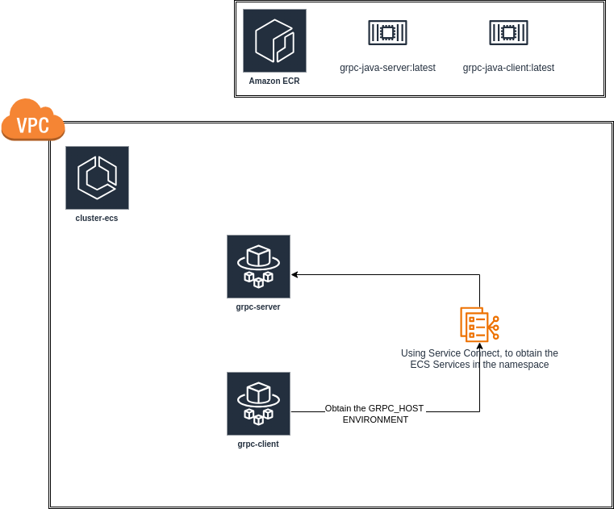
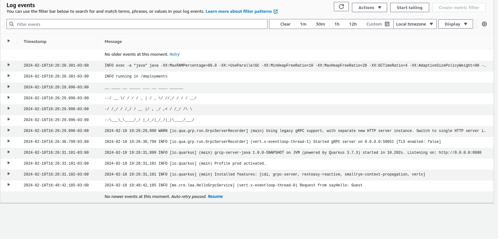
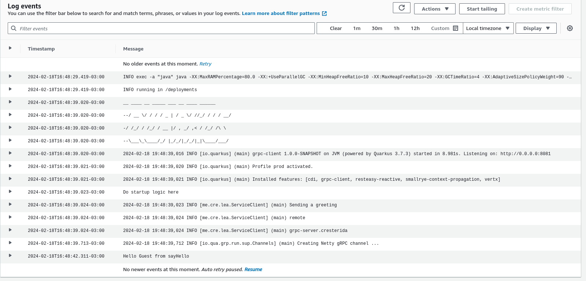

### Installing 2 ecs services on fargate

- One will be the client.

- One will be the server.


### Requirements

- AWS Account
- ECR with the images already uploaded.
- AWS CDK boostraped (cdk bootstrap aws://ACCOUNT-NUMBER/REGION)
- Docker installed


- To upload the images to ECR, you can use the following commands:

```bash
aws ecr get-login-password --region us-east-1 | docker login --username AWS --password-stdin 123456789012.dkr.ecr.us-east-1.amazonaws.com
docket tag my-web-app:latest 123456789012.dkr.ecr.us-east-1.amazonaws.com/my-web-app:latest
docker push 123456789012.dkr.ecr.us-east-1.amazonaws.com/my-web-app:latest
```


### Libs

- AWS CDK


### Execute stack

```bash
cdk deploy InfraStack

```


### Remember to destroy the universe.

```bash
cdk destroy InfraStack
```


### Diagram




### Show logs

- Server 




- Client


